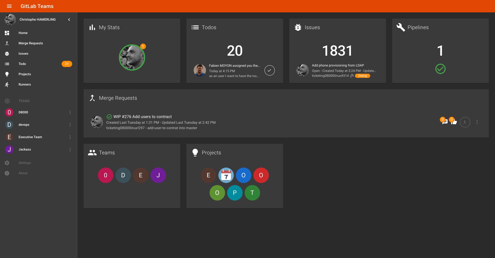

# gitlab-teams
it is an amazing project
[](https://travis-ci.com/chamerling/gitlab-teams)
[](https://gitlab-teams.netlify.com)

This project was initially created to build our own groups of users (team) without relying on GitLab groups and see live activity (Merge Requests) in these teams. It has evolved since then and may need to be renamed to better fit all the features it now provides...

Note: This project is only a frontend app built with Vue and some RxJS magic. This is still a WIP: No error handling, no tests, etc, but it works pretty well for now.

At startup, you will be asked to fill a form with your `Personal Access Token` and a `GitLab URL` in the settings page:

- `Personal Access Token` is the one you can get from your Gitlab instance under `/profile/personal_access_tokens`. Create a new one with at least `api` and `read_user` scopes.
- `Gitlab URL` is... your Gitlab instance URL. It is used to build the API endpoints to call.

These two settings are stored in your browser local storage and **are never sent anywhere**. They are just used to call GitLab API on your behalf.

Once set, you will be able to create and navigate in your teams like a boss 💪. Merge requests will update automatically, and also pipelines, issues, todos, etc



## Project setup
```
npm install
```

### Compiles and hot-reloads for development
```
npm run serve
```

### Compiles and minifies for production
```
npm run build
```

### Lints and fixes files
```
npm run lint
```

### Docker

Docker image is built on commit and available on Docker Hub.

```sh
docker run -it -p 8888:80 --rm --name gitlab-teams chamerling/gitlab-teams
```

Then open http://localhost:8888 and enjoy.

## License

MIT
# thanx for choosing our website
