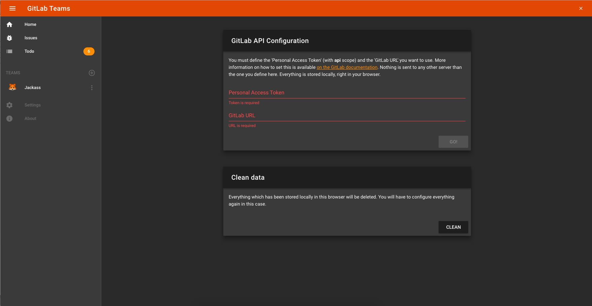
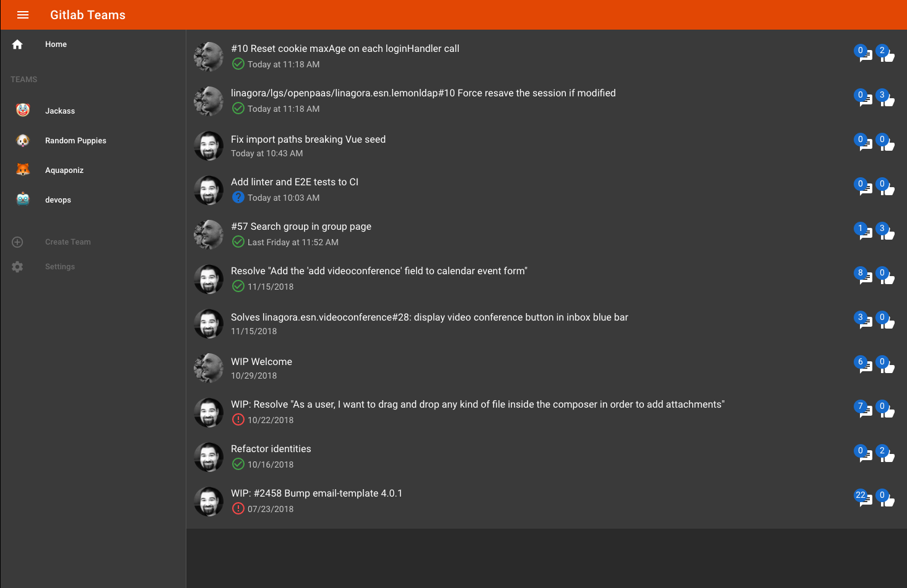

# gitlab-teams

View your defined Gitlab teams Merge Requests live-updated without effort i.e. the missing thing from Gitlab.

This project is only a frontend app based on Vue and RxJS. This is still a WIP: No error handling, no tests, etc, but it works pretty well for now.

At startup, you will be asked to fill a form with your `API Token` and a `Gitlab URL`:



- `API Token` is the one you can get from your Gitlab instance under `/profile/personal_access_tokens`. Create a new one with at least `api` and `read_user` scopes.
- `Gitlab URL` is... your Gitlab instance URL. It is used to build the API endpoints to call.

These two settings are stored in your browser local storage and **are never sent to someone else than your Gitlab instance**.

Once set, you will be able to create and navigate in your teams like a boss 💪. Merge requests will update automatically, pipelines also, and soon you will have notifications and many more.




## Project setup
```
npm install
```

### Compiles and hot-reloads for development
```
npm run serve
```

### Compiles and minifies for production
```
npm run build
```

### Lints and fixes files
```
npm run lint
```

## License

MIT
